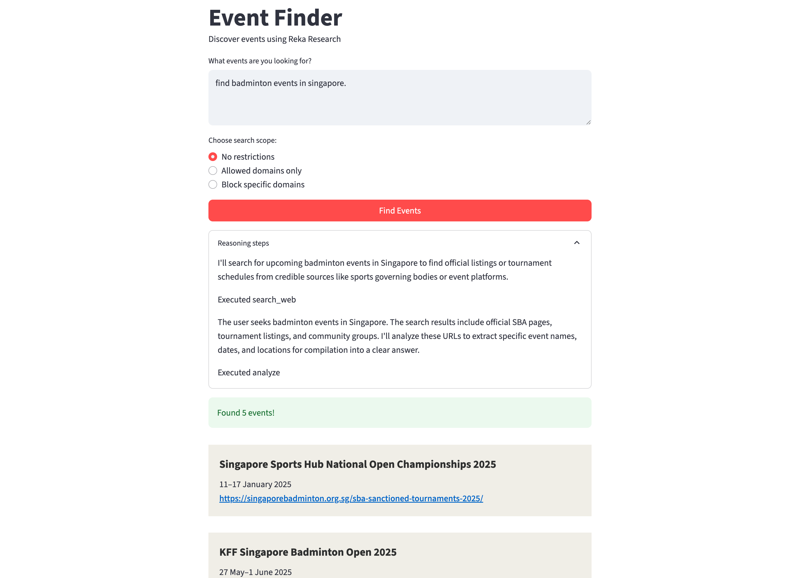

# Event Finder with Reka Research

This demo shows how to use the with the [Reka Research](https://docs.reka.ai/research) with Reka API to search the web and return structured output using `response_format`.

It's built with Streamlit.

## Features

- Uses `response_format` to get structured event data (title, date, URL)
- Uses `research["web_search"]` to control which domains are searched
- Displays reasoning steps during streaming
- Shows results in styled event cards based on structured output

📚 Learn more in our [documentation](https://docs.reka.ai/research/):

- [Strucutred Output](https://docs.reka.ai/research/structured-output)
- [Web Search](https://docs.reka.ai/research/web-search)

## How it works

1. User enters a query like:

   > Find AI conferences in Tokyo next month

2. User can choose to:
   - Allow all web results
   - Limit results to specific domains (e.g. `eventbrite.com`)
   - Block results from specific domains

3. The app sends a streaming request to the Reka API with:
   - A JSON schema as `response_format`
   - A research config as `research`

4. The model searches the web and returns structured results like:

   ```json
   {
     "events": [
       {
         "title": "AI Expo Tokyo",
         "date": "2025-07-10",
         "url": "https://aiexpo.jp"
       }
     ]
   }
   ```

5. The app renders this as UI elements in the browser.

## Running the app

1. Make sure you have Python, Streamlit and OpenAI SDK installed.

   ```bash
   pip install streamlit openai
   ```

2. Set your Reka API key in the environment:

   ```bash
   export REKA_API_KEY=your-api-key
   ```

   Sign up for a Reka API key at [Reka Platform](https://platform.reka.ai/) if you don’t already have one.

3. Run the app:

   ```bash
   streamlit run app.py
   ```

---



## File structure

- `app.py`: Main Streamlit app
- `README.md`: This guide

## Notes

- You can change the schema to get other structured formats, like job listings or product data.
- This app uses `reka-flash-research` with streaming enabled.
