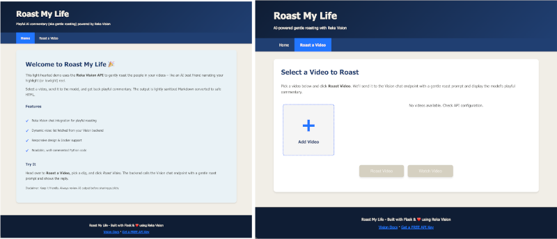
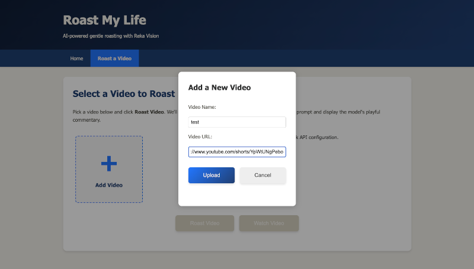

# Roast My Life: AI Commentary on Your Camera Roll - Workshop

Ever wanted an AI best friend to comment on your terrible life choices? Now you can build one. In this workshop you’ll build a small Flask app that lists your videos from Reka Vision, lets you add new ones, and sends one to a Vision QA endpoint for a gentle roast. You’ll paste the code step-by-step into placeholders inside the app.

Important: In this workshop you will copy/paste the exact code provided in each step into the placeholders in:

- `app.py`
- `templates/form.html`

If something already exists in those files and duplicates what you’re asked to paste, it’s because we removed it to make the workshop hands-on. Just paste the code exactly where indicated by the STEP markers.

## Workshop Agenda

By the end you will:

- Prepare the Python environment and configure credentials
- Explore the app structure
- Paste the code to: list videos, upload videos, and roast a selected video
- Run it locally and try ideas to extend it

## Introduction to Reka Vision API

The Reka Vision API provides powerful video processing and analysis capabilities, enabling you to upload, manage, and interact with videos using AI-powered question answering. With feature like: 

- Video Management: Upload, retrieve, list, and delete videos
- Video Search: Find videos using semantic search
- Video Q&A: Ask questions about video content and get AI-powered answers with streaming support
- Metadata Tagging: Generate tags for videos
- Highlight Reel Generation: Generate shorter highlight reels from your longer videos

This workshop will demonstrate three key API calls:
- List videos 
- Upload a video 
- Ask a Vision QA chat to “gently roast” a selected video 

The security uses API keys passed in the `X-Api-Key` header. In a upcoming step you’ll get your own free key.

# Setting up the development environment

We’ll use Python 3.9+ with Flask. First move into the workshop folder, then create and activate a virtual environment, and install dependencies from the provided requirements file:

```bash
# From the repo root
cd roast_my_life/workshop

# Create virtual environment and install dependencies
python3 -m venv .venv
source .venv/bin/activate
pip install -r requirements.txt
```

Environment variables: this app reads settings from a `.env` file. A ready-to-edit sample is provided as `.env-sample`.

Create your `.env` by copying the sample and then edit the values:

```bash
cp .env-sample .env
```

Edit `.env` (same keys as below):

```env
API_KEY=YOUR_REKA_API_KEY
BASE_URL=https://vision-agent.api.reka.ai
```

Run the app:

```bash
python app.py
# App starts on http://127.0.0.1:5000
```

Open <http://127.0.0.1:5000> in your browser.



As you noticed the app in the current status is not functional yet. Let's fix in the next steps.

## Getting your API key

You need a Reka API key with access to Vision features. Here how to key a FREE key:

1. Go to the [Reka Platform dashboard](https://link.reka.ai/free)
1. Open the API Keys section on the left
1. Create a new key and copy it to your environment
1. Add it to `.env` as `API_KEY`.


# Making the App Dynamic

Key files we’ll edit:

- `app.py` — Flask server, routes and API calls
- `templates/form.html` — UI for selecting/adding videos and invoking the roast

You’ll see STEP markers in these files, like:

```text
# STEP: Listing videos dynamically — paste function from README below
```

Paste the code from the matching step directly below those markers.


## Adding your own videos

Before you can roast a video, you need to add one (or more) first. In this step you’ll enable the “Add Video” popup to upload a video URL to the Reka API. This is handled by the `/api/upload_video` route in `app.py`.

### Backend: Upload API route

Paste into `app.py` at the STEP marker for “Add your own videos (Upload API route)”: replace the placeholder route with the following complete function:

```python
@app.route('/api/upload_video', methods=['POST'])
def upload_video() -> Dict[str, Any]:
    """
    Upload a new video to the Reka Vision API.

    Expects JSON body: { "video_name": "string", "video_url": "string" }

    Returns:
        Dict[str, Any]: JSON response with fields:
            success (bool)
            video_id (str) when successful
            error (str) when not successful
    """
    data = request.get_json() or {}
    video_name = data.get('video_name', '').strip()
    video_url = data.get('video_url', '').strip()

    if not video_name or not video_url:
        return jsonify({"error": "Both video_name and video_url are required"}), 400

    if not api_key:
        return jsonify({"error": "API key not configured"}), 500

    # Call Reka API to upload video
    try:
        response = requests.post(
            f"{base_url.rstrip('/')}/videos/upload",
            headers={
                "X-Api-Key": api_key
            },
            data={
                'video_name': video_name,
                'index': 'true',
                'video_url': video_url
            },
            timeout=30
        )
        
        # Try to parse the response
        try:
            response_data = response.json()
        except Exception:
            response_data = {}

        if response.ok:
            # Invalidate cache to force refresh
            _VIDEO_CACHE["timestamp"] = 0.0
            
            video_id = response_data.get('video_id', 'unknown')
            return jsonify({
                "success": True, 
                "video_id": video_id,
                "message": "Video uploaded successfully"
            })
        else:
            error_msg = response_data.get('error') or response_data.get('message') or f"HTTP {response.status_code}"
            return jsonify({"success": False, "error": f"Upload failed: {error_msg}"}), response.status_code

    except requests.Timeout:
        return jsonify({"success": False, "error": "Request timed out"}), 504
    except Exception as e:
        return jsonify({"success": False, "error": f"Upload failed: {str(e)}"}), 500
```

#### What the code does

This code validates your request and credentials, forwards the upload to Reka Vision, and handles success, API errors, and timeouts in a user-friendly way. 

It first checks that both `video_name` and `video_url` are present (otherwise it returns HTTP 400 with `{ "error": "Both video_name and video_url are required" }`). It also verifies that `API_KEY` is configured; if not, it returns HTTP 500 with `{ "error": "API key not configured" }`.

For the upload itself, it issues a `POST` to `{base_url}/videos/upload` with your API key in the `X-Api-Key` header. The body is form-encoded (because `requests` uses `application/x-www-form-urlencoded` when `data=` is provided) and includes `video_name`, `video_url`, and `index=true`. The `index=true` flag is required—it tells the server to process and index the video for search/QA. The request times out after 30 seconds.

The response is parsed as JSON when possible; if the body isn’t JSON, it’s treated as an empty object to avoid crashes. On success (any 2xx), the handler invalidates the local cache by setting `_VIDEO_CACHE["timestamp"] = 0.0` so the next list fetch refetches from the API, and returns HTTP 200 with `{ success: true, video_id, message: "Video uploaded successfully" }` (falling back to `video_id: "unknown"` if it’s missing upstream). If the API returns a non‑2xx, it surfaces the upstream `error` or `message` when available; otherwise it shows `HTTP <status>` and propagates that same status (e.g., 400/401/403/4xx/5xx).

- Timeout: returns HTTP 504 with `{ success: false, error: "Request timed out" }` if the upload exceeds 30s.
- Unexpected exceptions: returns HTTP 500 with `{ success: false, error: "Upload failed: <details>" }`.

Notes:
- Cache invalidation only flips the timestamp; the list refreshes on the next fetch.
- No deduplication or retries are attempted; uploading the same URL twice depends on server behavior.


### Frontend: Upload popup

Next, enable the “Add Video” popup to call this route. Paste into `templates/form.html` at the STEP marker "Add video popup interactions" inside the existing `<script>`.

```javascript
// Show the Add Video popup form
function showAddVideoPopup() {
  document.getElementById('addVideoPopup').style.display = 'flex';
  document.getElementById('videoName').value = '';
  document.getElementById('videoUrl').value = '';
  document.getElementById('popupError').textContent = '';
}

// Hide the Add Video popup form
function hideAddVideoPopup() {
  document.getElementById('addVideoPopup').style.display = 'none';
}

// Upload a new video to the Reka API via the backend
async function uploadVideo() {
  const name = document.getElementById('videoName').value.trim();
  const url = document.getElementById('videoUrl').value.trim();
  const errorDiv = document.getElementById('popupError');

  errorDiv.textContent = '';

  if (!name || !url) {
    errorDiv.textContent = 'Please enter both name and video URL.';
    return;
  }

  try {
    const response = await fetch('/api/upload_video', {
      method: 'POST',
      headers: {
        'Content-Type': 'application/json',
      },
      body: JSON.stringify({
        video_name: name,
        video_url: url
      })
    });

    const data = await response.json();

    if (response.ok && data.success) {
      hideAddVideoPopup();
      // Reload the page to show the new video
      location.reload();
    } else {
      errorDiv.textContent = data.error || 'Failed to upload video.';
    }
  } catch (err) {
    errorDiv.textContent = 'Error: ' + err.message;
  }
}
```

#### What the code does

This JavaScript code provides the frontend functionality for the "Add Video" popup form. It consists of three main functions:

1. **`showAddVideoPopup()`** - Opens the video upload popup by setting its display style to 'flex', clears any previous form values (video name and URL inputs), and resets any error messages to provide a clean slate for the user.

2. **`hideAddVideoPopup()`** - Closes the popup by hiding it (setting display to 'none'), typically called after a successful upload or when the user cancels.

3. **`uploadVideo()`** - Handles the actual video upload process:
   - Validates that both name and URL fields are filled out
   - Makes an asynchronous POST request to the `/api/upload_video` backend endpoint, added previously.
   - Sends the video data as JSON with `video_name` and `video_url` fields
   - On success: closes the popup and reloads the page to show the newly added video in the grid
   - On failure: displays the error message in the popup without closing it, allowing the user to correct the issue and retry

The code includes proper error handling for both validation (empty fields) and network issues (API failures), providing user-friendly feedback through the `popupError` element.



Try it: run the app, open the "Roast a Video" page, click "Add Video", enter a name and URL, then Upload. On success the grid will try to refresh but some code is still missing to list videos dynamically. Next step we’ll fix that.


## Listing videos dynamically

Next, enable dynamic video listing by fetching from the API and handing a simplified list to the template.

Paste into `app.py` at the STEP marker for “Listing videos dynamically — fetch_videos()”: replace the placeholder with the following function:

```python
def fetch_videos() -> List[Dict[str, Any]]:
    """
    Fetch the list of videos from Reka Vision API, with basic caching.

    The API is expected to respond with a JSON structure containing a
    "results" key that holds a list of video objects. Each video includes
    metadata with fields like "title" and "thumbnail".

    Returns:
        List[Dict[str, Any]]: List of video dictionaries from the API.
    """
    now = time.time()
    is_stale = (now - _VIDEO_CACHE["timestamp"]) > _VIDEO_CACHE["ttl"]

    if not base_url:
        # Without BASE_URL we can't call the API; return empty.
        return []

    url = f"{base_url.rstrip('/')}/videos/get"
    headers = {}
    if api_key:
        headers["X-Api-Key"] = api_key

    try:
        response = requests.post(url, headers=headers, timeout=10)
        response.raise_for_status()
        data = response.json()
        results = data.get("results", [])
        _VIDEO_CACHE.update({
            "timestamp": now,
            "results": results
        })
        return results
    except Exception as e:
        # On failure, keep old cache if available; otherwise empty list.
        if _VIDEO_CACHE["results"]:
            return _VIDEO_CACHE["results"]
        return []
```

This function:

- Calls `{BASE_URL}/videos/get` with your API key
- Caches results briefly to avoid repeated calls
- Returns a list of videos used by the template (already wired in `form_page()`)

You don’t need to change the Jinja template loop — it already iterates over `videos`.

## Add the roasting functionality

Finally, wire up the roast. This has three parts:

1. A function to call the Vision QA endpoint
2. A function to convert markdown to HTML for display
3. A Flask route that glues it together and returns the result to the browser
4. Front-end JavaScript to select a video, call the backend, and show the response

Paste into `app.py` at the STEP marker for “Roast: Vision QA call (backend)”: replace the placeholder with this function:

```python
def call_reka_vision_qa(video_id: str) -> Dict[str, Any]:
    """Call the Reka Video QA API for a given video.

    The request format follows the user's provided specification. We issue a
    POST request with the video_id and a static user prompt asking to gently
    roast the person in the video.

    Environment Variables:
        REKA_VIDEO_QA_ENDPOINT: Optional override for the API endpoint.
            If not set, defaults to {base_url}/qa/chat
        api_key or API_KEY: API key placed in the X-Api-Key header.

    Parameters:
        video_id (str): The UUID of the video to query.

    Returns:
        Dict[str, Any]: Parsed JSON response (may include keys like
        chat_response, system_message, error, status, etc.). On total failure
        returns a dict with an 'error' key.
    """
    headers = {}
    if api_key:
        headers['X-Api-Key'] = api_key

    payload = {
        "video_id": video_id,
        "messages": [
            {
                "role": "user",
                "content": "Write a funny and gently roast about the person, or the voice in this video. Reply in a markdown format."
            }
        ]
    }

    try:
        resp = requests.post(
            REKA_VIDEO_QA_ENDPOINT,
            headers=headers,
            json=payload,
            timeout=30
        )
        # Even on non-2xx we attempt to parse JSON for richer error context.
        data: Dict[str, Any]
        try:
            data = resp.json()
        except Exception:
            data = {"error": f"Non-JSON response (status {resp.status_code})"}

        if not resp.ok and 'error' not in data:
            data['error'] = f"HTTP {resp.status_code} calling chat endpoint"
        return data
    except requests.Timeout:
        return {"error": "Request to chat API timed out"}
    except Exception as e:  # broad catch to avoid propagating unexpected errors
        return {"error": f"Chat API call failed: {e}"}
```

Paste into `app.py` at the STEP marker for “Roast: markdown to HTML”: replace the placeholder with this function:

```python
def simple_markdown_to_html(md: str) -> str:
    """
    Convert Markdown text to HTML using the Python-Markdown library.

    This function uses the 'markdown' package for robust Markdown parsing and HTML output.
    Any HTML in the source is safely handled by the library to mitigate injection risks.

    Parameters:
        md (str): Markdown input string.

    Returns:
        str: HTML output.
    """
    if not md:
        return ""
    import markdown
    # Use 'extra' and 'sane_lists' extensions for better Markdown support
    return markdown.markdown(md, extensions=['extra', 'sane_lists'])
```

Paste into `app.py` at the STEP marker for “Roast API route (/api/process)”: replace the placeholder with this route:

```python
@app.route('/api/process', methods=['POST'])
def process_video() -> Dict[str, Any]:
    """
    Process the selected video by calling the external Reka chat API.

    We still optionally build a local metadata summary (kept for potential
    future UI use), but the primary output shown to the user is the
    `chat_response` returned by the external API. If `chat_response` is null
    we fall back to `system_message`, then `error`.

    Expects JSON body: { "video_id": "uuid" }

    Returns:
        Dict[str, Any]: JSON response with fields:
            success (bool)
            result (str) when success
            error (str) when not successful
    """
    data = request.get_json() or {}
    video_id = data.get('video_id')

    if not video_id:
        return jsonify({"error": "No video ID provided"}), 400

    api_data = call_reka_vision_qa(video_id)

    # Determine final message to surface.
    chat_response = api_data.get('chat_response')
    system_msg = api_data.get('system_message')
    api_error = api_data.get('error')

    if chat_response:
        # Convert Markdown roast text to HTML for display.
        html_result = simple_markdown_to_html(chat_response)
        return jsonify({"success": True, "result": html_result})

    # No chat_response; decide best fallback.
    fallback = system_msg or api_error
    if not fallback:
        fallback = "Unknown error: chat_response missing."
    return jsonify({"success": False, "error": fallback})
```

Now add the browser-side logic. Paste into `templates/form.html` at the STEP marker inside the existing `<script>` tag (do NOT add another `<script>` wrapper):

```javascript


// Handle video selection from the grid
function selectVideo(videoId) {
  selectedVideoId = videoId;

  // Remove 'selected' class from all cards
  document.querySelectorAll('.image-card').forEach(card => {
    card.classList.remove('selected');
  });

  // Add 'selected' class to clicked card
  const selectedCard = document.querySelector(`.image-card[data-id="${videoId}"]`);
  if (selectedCard) {
    selectedCard.classList.add('selected');
    selectedVideoUrl = selectedCard.getAttribute('data-url');
  }

  // Enable the process button
  document.getElementById('processBtn').disabled = false;

  // Enable the watch button if URL is available
  const watchBtn = document.getElementById('watchBtn');
  watchBtn.disabled = !(selectedVideoUrl && selectedVideoUrl.trim() !== '');

  // Hide previous results and errors
  document.getElementById('resultSection').classList.remove('show');
  document.getElementById('errorMessage').classList.remove('show');
}

// Process the selected video by calling the backend
async function processVideo() {
  if (!selectedVideoId) {
    showError('Please select a video first');
    return;
  }

  // Show spinner and hide previous results
  document.getElementById('spinner').classList.add('show');
  document.getElementById('resultSection').classList.remove('show');
  document.getElementById('errorMessage').classList.remove('show');
  document.getElementById('processBtn').disabled = true;

  try {
    const response = await fetch('/api/process', {
      method: 'POST',
      headers: {
        'Content-Type': 'application/json',
      },
      body: JSON.stringify({
        video_id: selectedVideoId
      })
    });

    const data = await response.json();

    if (response.ok && data.success) {
      // Display the result (already sanitized / converted server-side)
      document.getElementById('resultContent').innerHTML = data.result;
      document.getElementById('resultSection').classList.add('show');
    } else {
      // Display error
      showError(data.error || 'An error occurred while processing your request');
    }
  } catch (error) {
    showError('Failed to connect to the API: ' + error.message);
  } finally {
    // Hide spinner and re-enable button
    document.getElementById('spinner').classList.remove('show');
    document.getElementById('processBtn').disabled = false;
  }
}

// Display an error message to the user
function showError(message) {
  const errorElement = document.getElementById('errorMessage');
  errorElement.textContent = message;
  errorElement.classList.add('show');
}

// Open the selected video in a new tab
function watchVideo() {
  if (!selectedVideoUrl || selectedVideoUrl.trim() === '') {
    showError('No video URL available for this video');
    return;
  }
  window.open(selectedVideoUrl, '_blank');
}
```

What the roast pieces do:

- Backend calls Vision QA with your `video_id` and a roast-style prompt
- It returns `chat_response` (markdown) or an error; we convert markdown to HTML
- Front-end selects a video card, calls `/api/process`, and injects the HTML into the page

Try it:

1) Start the app and open the form page
2) Select a video, click “Roast Video”
3) See the playful commentary appear in the result panel

## ideas for extending the app

- Stream the roast response token-by-token
- Add a history panel of past roasts
- Allow user-provided roast prompts (e.g., funny, poetic, motivational)
- Add thumbnails when they’re available; improve “processing” placeholders
- Show upload progress and validation of video URLs

