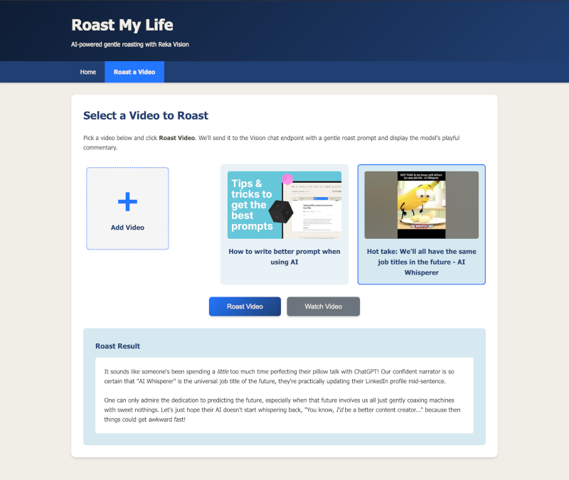

# Roast My Life: AI Commentary on Your Camera Roll - Workshop

Ever wanted an AI best friend to comment on your terrible life choices? Now you can build one! 

In this workshop, you'll build a small Flask app that:
- Lists your videos from Reka Vision
- Lets you add new videos
- Sends a selected video to a Vision QA endpoint for a gentle roast

You'll paste the code step-by-step into placeholders inside the app to make it fully functional.

## 📚 Table of Contents

1. [📋 Important Instructions](#📋-important-instructions)
2. [🎯 Workshop Agenda](#🎯-workshop-agenda)
3. [👀 Introduction to Reka Vision API](#🔍-introduction-to-reka-vision-api)
4. [🚀 Setting Up the Development Environment](#🚀-setting-up-the-development-environment)
5. [🔑 Getting Your API Key](#🔑-getting-your-api-key)
6. [💻 Making the App Dynamic](#💻-making-the-app-dynamic)
7. [📤 Adding Your Own Videos](#📤-adding-your-own-videos)
8. [📋 Listing Videos Dynamically](#📋-listing-videos-dynamically)
9. [🔥 Add the Roasting Functionality](#🔥-add-the-roasting-functionality)
10. [💡 Ideas for Extending the App](#💡-ideas-for-extending-the-app)
11. [🎉 Conclusion](#🎉-conclusion)

## 📋 Important Instructions

In this workshop, you will copy/paste the exact code provided in each step into the placeholders in:
- `app.py`
- `templates/form.html`

If something already exists in those files and duplicates what you're asked to paste, it's because we removed it to make the workshop hands-on. Just paste the code exactly where indicated by the **STEP** markers.

## 🎯 Workshop Agenda

By the end of this workshop, you will:
- ✅ Prepare the Python environment and configure credentials
- ✅ Explore the app structure
- ✅ Implement functionality to list videos, upload videos, and roast a selected video
- ✅ Run the app locally and explore ideas to extend it

## 👀 Introduction to Reka Vision API

The Reka Vision API provides powerful video processing and analysis capabilities, enabling you to upload, manage, and interact with videos using AI-powered question answering. 

### Key Features
- **Video Management**: Upload, retrieve, list, and delete videos
- **Video Search**: Find videos using semantic search
- **Video Q&A**: Ask questions about video content and get AI-powered answers with streaming support
- **Metadata Tagging**: Generate tags for videos
- **Highlight Reel Generation**: Generate shorter highlight reels from your longer videos

### Workshop Focus
This workshop will demonstrate three key API calls:
1. **List videos** - Retrieve existing videos from your account
2. **Upload a video** - Add new videos via URL
3. **Ask a Vision QA chat** - Generate a "gentle roast" of a selected video

### Authentication
The API uses secure authentication with API keys passed in the `X-Api-Key` header. In an upcoming step, you'll get your own free key.

# 🚀 Setting Up the Development Environment

We'll use Python 3.9+ with Flask for this workshop.

## Step 1: Clone the repository

Open a terminal, and get a local copy of this repository with the following command:

   ```bash
   git clone https://github.com/reka-ai/api-examples-python.git
   ```

## Step 2: Navigate to Workshop Directory

From the repository root, navigate to the workshop folder:

```bash
cd api-examples-python/roast_my_life/workshop
```

## Step 3: Create Python Virtual Environment

Create and activate a virtual environment, then install dependencies:

```bash
# Create virtual environment
python3 -m venv .venv

# Activate virtual environment
source .venv/bin/activate

# Install dependencies
pip install -r requirements.txt
```

## Step 4: Configure Environment Variables

This app reads settings from a `.env` file. A ready-to-edit sample is provided as `.env-sample`.

Create your `.env` file:

```bash
cp .env-sample .env
```

Edit the `.env` file with your configuration:

```env
API_KEY=YOUR_REKA_API_KEY
BASE_URL=https://vision-agent.api.reka.ai
```

## Step 5: Run the Application

Start the Flask development server:

```bash
python app.py
# App starts on http://127.0.0.1:5000
```

Open <http://127.0.0.1:5000> in your browser to see the application.


> **Note**: The app is not functional yet in its current state. We'll fix this in the following steps!

## 🔑 Getting Your API Key

You need a Reka API key with access to Vision features. Here's how to get a **FREE** key:

1. Go to the [Reka Platform dashboard](https://link.reka.ai/free)
2. Open the **API Keys** section on the left
3. Create a new key and copy it to your environment
4. Add it to `.env` as `API_KEY`


# 💻 Making the App Dynamic

In this section, we'll add the core functionality to make the app interactive and fully functional.

## Key Files We'll Edit

- **`app.py`** — Flask server, routes and API calls
- **`templates/form.html`** — UI for selecting/adding videos and invoking the roast

You'll see **STEP** markers in these files, like:

```text
# STEP: Listing videos dynamically — paste function from README below
```

Paste the code from the matching step directly below those markers.


## 📤 Adding Your Own Videos

Before you can roast a video, you need to add one (or more) first. In this step, you'll enable the "Add Video" popup to upload a video URL to the Reka API. This functionality is handled by the `/api/upload_video` route in `app.py`.

### Backend: Upload API Route

Paste into `app.py` at the **STEP** marker for "Add your own videos (Upload API route)": replace the placeholder route with the following complete function:

```python
@app.route('/api/upload_video', methods=['POST'])
def upload_video() -> Dict[str, Any]:
    """
    Upload a new video to the Reka Vision API.

    Expects JSON body: { "video_name": "string", "video_url": "string" }

    Returns:
        Dict[str, Any]: JSON response with fields:
            success (bool)
            video_id (str) when successful
            error (str) when not successful
    """
    data = request.get_json() or {}
    video_name = data.get('video_name', '').strip()
    video_url = data.get('video_url', '').strip()

    if not video_name or not video_url:
        return jsonify({"error": "Both video_name and video_url are required"}), 400

    if not api_key:
        return jsonify({"error": "API key not configured"}), 500

    # Call Reka API to upload video
    try:
        response = requests.post(
            f"{base_url.rstrip('/')}/videos/upload",
            headers={
                "X-Api-Key": api_key
            },
            data={
                'video_name': video_name,
                'index': 'true',
                'video_url': video_url
            },
            timeout=30
        )
        
        # Try to parse the response
        try:
            response_data = response.json()
        except Exception:
            response_data = {}

        if response.ok:
            # Invalidate cache to force refresh
            _VIDEO_CACHE["timestamp"] = 0.0
            
            video_id = response_data.get('video_id', 'unknown')
            return jsonify({
                "success": True, 
                "video_id": video_id,
                "message": "Video uploaded successfully"
            })
        else:
            error_msg = response_data.get('error') or response_data.get('message') or f"HTTP {response.status_code}"
            return jsonify({"success": False, "error": f"Upload failed: {error_msg}"}), response.status_code

    except requests.Timeout:
        return jsonify({"success": False, "error": "Request timed out"}), 504
    except Exception as e:
        return jsonify({"success": False, "error": f"Upload failed: {str(e)}"}), 500
```

#### 🔍 What the Code Does

This code validates your request and credentials, forwards the upload to Reka Vision, and handles success, API errors, and timeouts in a user-friendly way. 

It first checks that both `video_name` and `video_url` are present (otherwise it returns HTTP 400 with `{ "error": "Both video_name and video_url are required" }`). It also verifies that `API_KEY` is configured; if not, it returns HTTP 500 with `{ "error": "API key not configured" }`.

For the upload itself, it issues a `POST` to `{base_url}/videos/upload` with your API key in the `X-Api-Key` header. The body is form-encoded (because `requests` uses `application/x-www-form-urlencoded` when `data=` is provided) and includes `video_name`, `video_url`, and `index=true`. The `index=true` flag is required—it tells the server to process and index the video for search/QA. The request times out after 30 seconds.

The response is parsed as JSON when possible; if the body isn’t JSON, it’s treated as an empty object to avoid crashes. On success (any 2xx), the handler invalidates the local cache by setting `_VIDEO_CACHE["timestamp"] = 0.0` so the next list fetch refetches from the API, and returns HTTP 200 with `{ success: true, video_id, message: "Video uploaded successfully" }` (falling back to `video_id: "unknown"` if it’s missing upstream). If the API returns a non‑2xx, it surfaces the upstream `error` or `message` when available; otherwise it shows `HTTP <status>` and propagates that same status (e.g., 400/401/403/4xx/5xx).

- Timeout: returns HTTP 504 with `{ success: false, error: "Request timed out" }` if the upload exceeds 30s.
- Unexpected exceptions: returns HTTP 500 with `{ success: false, error: "Upload failed: <details>" }`.

Notes:
- Cache invalidation only flips the timestamp; the list refreshes on the next fetch.
- No deduplication or retries are attempted; uploading the same URL twice depends on server behavior.


### Frontend: Upload Popup

Next, enable the "Add Video" popup to call this route. Paste into `templates/form.html` at the **STEP** marker "Add video popup interactions" inside the existing `<script>`.

```javascript
// Show the Add Video popup form
function showAddVideoPopup() {
  document.getElementById('addVideoPopup').style.display = 'flex';
  document.getElementById('videoName').value = '';
  document.getElementById('videoUrl').value = '';
  document.getElementById('popupError').textContent = '';
}

// Hide the Add Video popup form
function hideAddVideoPopup() {
  document.getElementById('addVideoPopup').style.display = 'none';
}

// Upload a new video to the Reka API via the backend
async function uploadVideo() {
  const name = document.getElementById('videoName').value.trim();
  const url = document.getElementById('videoUrl').value.trim();
  const errorDiv = document.getElementById('popupError');

  errorDiv.textContent = '';

  if (!name || !url) {
    errorDiv.textContent = 'Please enter both name and video URL.';
    return;
  }

  try {
    const response = await fetch('/api/upload_video', {
      method: 'POST',
      headers: {
        'Content-Type': 'application/json',
      },
      body: JSON.stringify({
        video_name: name,
        video_url: url
      })
    });

    const data = await response.json();

    if (response.ok && data.success) {
      hideAddVideoPopup();
      // Reload the page to show the new video
      location.reload();
    } else {
      errorDiv.textContent = data.error || 'Failed to upload video.';
    }
  } catch (err) {
    errorDiv.textContent = 'Error: ' + err.message;
  }
}
```

#### 🔍 What the Code Does

This JavaScript code provides the frontend functionality for the "Add Video" popup form. It consists of three main functions:

1. **`showAddVideoPopup()`** - Opens the video upload popup by setting its display style to 'flex', clears any previous form values (video name and URL inputs), and resets any error messages to provide a clean slate for the user.

2. **`hideAddVideoPopup()`** - Closes the popup by hiding it (setting display to 'none'), typically called after a successful upload or when the user cancels.

3. **`uploadVideo()`** - Handles the actual video upload process:
   - Validates that both name and URL fields are filled out
   - Makes an asynchronous POST request to the `/api/upload_video` backend endpoint, added previously.
   - Sends the video data as JSON with `video_name` and `video_url` fields
   - On success: closes the popup and reloads the page to show the newly added video in the grid
   - On failure: displays the error message in the popup without closing it, allowing the user to correct the issue and retry

The code includes proper error handling for both validation (empty fields) and network issues (API failures), providing user-friendly feedback through the `popupError` element.


#### ✅ Try It

Execute the command `python app.py` to run the app, open the "Roast a Video" page, click "Add Video", enter a name and URL, then Upload. On success the grid will try to refresh but some code is still missing to list videos dynamically. Next step we'll fix that.

## 📋 Listing Videos Dynamically

Next, enable dynamic video listing by fetching from the API and handling a simplified list to the template.

Paste into `app.py` at the **STEP** marker for "Listing videos dynamically — fetch_videos()": replace the placeholder with the following function:

```python
def fetch_videos() -> List[Dict[str, Any]]:
    """
    Fetch the list of videos from Reka Vision API, with basic caching.

    The API is expected to respond with a JSON structure containing a
    "results" key that holds a list of video objects. Each video includes
    metadata with fields like "title" and "thumbnail".

    Returns:
        List[Dict[str, Any]]: List of video dictionaries from the API.
    """
    now = time.time()
    is_stale = (now - _VIDEO_CACHE["timestamp"]) > _VIDEO_CACHE["ttl"]

    if not base_url:
        # Without BASE_URL we can't call the API; return empty.
        return []

    url = f"{base_url.rstrip('/')}/videos/get"
    headers = {}
    if api_key:
        headers["X-Api-Key"] = api_key

    try:
        response = requests.post(url, headers=headers, timeout=10)
        response.raise_for_status()
        data = response.json()
        results = data.get("results", [])
        _VIDEO_CACHE.update({
            "timestamp": now,
            "results": results
        })
        return results
    except Exception as e:
        # On failure, keep old cache if available; otherwise empty list.
        if _VIDEO_CACHE["results"]:
            return _VIDEO_CACHE["results"]
        return []
```

#### 🔍 What the Code Does

This function implements a smart caching mechanism for fetching videos from the Reka Vision API. Here's how it works:

**Caching Logic**: The function first checks if the cached data is still fresh by comparing the current time with the cached timestamp plus the TTL (time-to-live). If the cache is stale or empty, it proceeds to fetch fresh data from the API.

**API Configuration**: Before making the request, it validates that `base_url` is configured (returns empty list if not). It constructs the API endpoint URL by appending `/videos/get` to the base URL, and prepares headers with the API key if available.

**API Call**: The function makes a POST request to the Reka Vision API's `/videos/get` endpoint with a 10-second timeout. It expects a JSON response containing a "results" key with an array of video objects.

**Error Handling & Resilience**: If the API call fails (network issues, timeouts, or API errors), the function gracefully falls back to serving cached data if available. This ensures the app remains functional even when the API is temporarily unavailable.

**Cache Management**: On successful API responses, it updates the cache with both the current timestamp and the fresh results, ensuring subsequent requests within the TTL period are served instantly from cache rather than hitting the API.

**Return Value**: The function always returns a list of video dictionaries, either from a fresh API call, from cache, or an empty list if no data is available and the API is unreachable.

#### ✅ Try It

Launch the app with `python app.py`, open the "Roast a Video" page, and you should see the grid populated with the video you uploaded in the previous step. The video is fetched from the Reka Vision API.

## 🔥 Add the Roasting Functionality

Finally, wire up the roast functionality! This has four main parts:

1. **A function to call the Vision QA endpoint**
2. **A function to convert markdown to HTML for display**
3. **A Flask route that glues it together and returns the result to the browser**
4. **Front-end JavaScript to select a video, call the backend, and show the response**

Paste into `app.py` at the **STEP** marker for "Roast: Vision QA call (backend)": replace the placeholder with this function:

```python
def call_reka_vision_qa(video_id: str) -> Dict[str, Any]:
    """Call the Reka Video QA API for a given video.

    The request format follows the user's provided specification. We issue a
    POST request with the video_id and a static user prompt asking to gently
    roast the person in the video.

    Environment Variables:
        REKA_VIDEO_QA_ENDPOINT: Optional override for the API endpoint.
            If not set, defaults to {base_url}/qa/chat
        api_key or API_KEY: API key placed in the X-Api-Key header.

    Parameters:
        video_id (str): The UUID of the video to query.

    Returns:
        Dict[str, Any]: Parsed JSON response (may include keys like
        chat_response, system_message, error, status, etc.). On total failure
        returns a dict with an 'error' key.
    """
    headers = {}
    if api_key:
        headers['X-Api-Key'] = api_key

    payload = {
        "video_id": video_id,
        "messages": [
            {
                "role": "user",
                "content": "Write a funny and gently roast about the person, or the voice in this video. Reply in a markdown format."
            }
        ]
    }

    try:
        resp = requests.post(
            REKA_VIDEO_QA_ENDPOINT,
            headers=headers,
            json=payload,
            timeout=30
        )
        # Even on non-2xx we attempt to parse JSON for richer error context.
        data: Dict[str, Any]
        try:
            data = resp.json()
        except Exception:
            data = {"error": f"Non-JSON response (status {resp.status_code})"}

        if not resp.ok and 'error' not in data:
            data['error'] = f"HTTP {resp.status_code} calling chat endpoint"
        return data
    except requests.Timeout:
        return {"error": "Request to chat API timed out"}
    except Exception as e:  # broad catch to avoid propagating unexpected errors
        return {"error": f"Chat API call failed: {e}"}
```

#### 🔍 What the Code Does

This function handles communication with the Reka Vision QA API to generate roasts for videos. Here's how it works:

**API Configuration**: The function constructs the proper headers including the API key from environment variables, ensuring secure authentication with the Reka Vision service.

**Request Payload**: It builds a structured JSON payload containing the `video_id` and a conversation message with the role "user" and a specific prompt asking for a funny, gentle roast in markdown format. This prompt engineering ensures consistent, appropriately-toned responses.

**API Communication**: The function makes a POST request to the Video QA endpoint with a 30-second timeout to prevent hanging requests. It uses the JSON payload format expected by the Reka Vision QA API.

**Error Handling & Resilience**: The function implements comprehensive error handling:
- **JSON Parsing**: Attempts to parse the response as JSON even on non-2xx status codes to capture richer error information from the API
- **HTTP Errors**: Detects non-successful HTTP status codes and adds appropriate error messages to the response data
- **Timeout Protection**: Catches request timeouts and returns a user-friendly timeout message
- **Exception Safety**: Uses broad exception catching to prevent unexpected errors from crashing the application

**Response Processing**: On successful API calls, it returns the parsed JSON response which typically includes a `chat_response` field containing the AI-generated roast in markdown format. The function preserves all response fields for downstream processing while ensuring failed requests always include an 'error' key.

Paste into `app.py` at the **STEP** marker for "Roast: markdown to HTML": replace the placeholder with this function:

```python
def simple_markdown_to_html(md: str) -> str:
    """
    Convert Markdown text to HTML using the Python-Markdown library.

    This function uses the 'markdown' package for robust Markdown parsing and HTML output.
    Any HTML in the source is safely handled by the library to mitigate injection risks.

    Parameters:
        md (str): Markdown input string.

    Returns:
        str: HTML output.
    """
    if not md:
        return ""
    import markdown
    # Use 'extra' and 'sane_lists' extensions for better Markdown support
    return markdown.markdown(md, extensions=['extra', 'sane_lists'])
```

#### 🔍 What the Code Does

This utility function converts markdown text to HTML for safe display in the web browser. Here's what it accomplishes:

**Markdown Processing**: Uses the robust Python-Markdown library to parse markdown syntax and convert it to properly formatted HTML. This handles common markdown elements like headers, bold/italic text, lists, links, and code blocks.

**Extension Support**: Includes the 'extra' and 'sane_lists' extensions which provide enhanced markdown features:
- **'extra'**: Adds support for tables, definition lists, footnotes, abbreviations, and other advanced markdown features
- **'sane_lists'**: Improves list handling to be more intuitive and consistent with modern markdown parsers

**Input Validation**: Checks for empty or null input and returns an empty string, preventing errors when processing undefined content.

**Security**: The Python-Markdown library includes built-in HTML sanitization to help prevent XSS attacks, making it safer than manual string manipulation for markdown conversion.

**Output Format**: Returns clean, standards-compliant HTML that can be directly inserted into the DOM using `innerHTML`, preserving the formatting and structure of the original markdown roast response.

Paste into `app.py` at the **STEP** marker for "Roast API route (/api/process)": replace the placeholder with this route:

```python
@app.route('/api/process', methods=['POST'])
def process_video() -> Dict[str, Any]:
    """
    Process the selected video by calling the external Reka chat API.

    We still optionally build a local metadata summary (kept for potential
    future UI use), but the primary output shown to the user is the
    `chat_response` returned by the external API. If `chat_response` is null
    we fall back to `system_message`, then `error`.

    Expects JSON body: { "video_id": "uuid" }

    Returns:
        Dict[str, Any]: JSON response with fields:
            success (bool)
            result (str) when success
            error (str) when not successful
    """
    data = request.get_json() or {}
    video_id = data.get('video_id')

    if not video_id:
        return jsonify({"error": "No video ID provided"}), 400

    api_data = call_reka_vision_qa(video_id)

    # Determine final message to surface.
    chat_response = api_data.get('chat_response')
    system_msg = api_data.get('system_message')
    api_error = api_data.get('error')

    if chat_response:
        roast_content = chat_response

        # Parse the JSON string to extract section content
        if isinstance(chat_response, str):
            try:
                import json
                parsed = json.loads(chat_response)
                if isinstance(parsed, dict) and 'sections' in parsed:
                    sections = parsed.get('sections', [])
                    content_parts = []
                    for section in sections:
                        if isinstance(section, dict) and 'section_content' in section:
                            content_parts.append(section['section_content'])

                    if content_parts:
                        roast_content = '\n\n'.join(content_parts)
            except (json.JSONDecodeError, ValueError):
                # If parsing fails, use the raw string as-is
                pass

        # Convert Markdown roast text to HTML for display
        html_result = simple_markdown_to_html(roast_content)
        return jsonify({"success": True, "result": html_result})

    # No chat_response; decide best fallback.
    fallback = system_msg or api_error
    if not fallback:
        fallback = "Unknown error: chat_response missing."
    return jsonify({"success": False, "error": fallback})
```

#### 🔍 What the Code Does

This Flask route serves as the main orchestrator for the video roasting feature, connecting the frontend request to the AI-powered response. Here's how it works:

**Request Validation**: The route first validates that a `video_id` is provided in the JSON request body. If missing, it immediately returns an HTTP 400 error with a clear message, preventing unnecessary API calls.

**API Integration**: It calls the `call_reka_vision_qa()` function to communicate with the Reka Vision API, passing the video ID and receiving the AI-generated roast response along with any metadata or error information.

**Response Parsing**: The API returns `chat_response` as a JSON string containing a nested structure with sections. The code parses this JSON to extract just the `section_content` fields, which contain the actual roast text, ignoring metadata like `section_id` and `section_type`. If parsing fails, it falls back to using the raw response string.

**Response Processing Logic**: The route implements a smart fallback hierarchy for handling different response scenarios:
- **Primary Response**: If `chat_response` is present, it parses sections and converts the markdown to HTML, returning a success response
- **Fallback Messages**: If no chat response is available, it tries `system_message` then `error` from the API response
- **Default Handling**: If none of the above are available, it provides a generic error message

**Content Transformation**: For successful roasts, it uses the `simple_markdown_to_html()` function to convert the AI's markdown response into properly formatted HTML that can be safely displayed in the browser.

**Error Handling**: The route provides consistent error responses in JSON format with `success: false` and descriptive error messages, ensuring the frontend can always parse and display appropriate feedback to users.

**Response Format**: Returns standardized JSON responses with either `{"success": true, "result": html_content}` for successful roasts or `{"success": false, "error": error_message}` for failures, making frontend error handling straightforward.


Now add the browser-side logic. Paste into `templates/form.html` at the **STEP** marker inside the existing `<script>` tag (do **NOT** add another `<script>` wrapper):

```javascript

// Handle video selection from the grid
function selectVideo(videoId) {
  selectedVideoId = videoId;

  // Remove 'selected' class from all cards
  document.querySelectorAll('.image-card').forEach(card => {
    card.classList.remove('selected');
  });

  // Add 'selected' class to clicked card
  const selectedCard = document.querySelector(`.image-card[data-id="${videoId}"]`);
  if (selectedCard) {
    selectedCard.classList.add('selected');
    selectedVideoUrl = selectedCard.getAttribute('data-url');
  }

  // Enable the process button
  document.getElementById('processBtn').disabled = false;

  // Enable the watch button if URL is available
  const watchBtn = document.getElementById('watchBtn');
  watchBtn.disabled = !(selectedVideoUrl && selectedVideoUrl.trim() !== '');

  // Hide previous results and errors
  document.getElementById('resultSection').classList.remove('show');
  document.getElementById('errorMessage').classList.remove('show');
}

// Process the selected video by calling the backend
async function processVideo() {
  if (!selectedVideoId) {
    showError('Please select a video first');
    return;
  }

  // Show spinner and hide previous results
  document.getElementById('spinner').classList.add('show');
  document.getElementById('resultSection').classList.remove('show');
  document.getElementById('errorMessage').classList.remove('show');
  document.getElementById('processBtn').disabled = true;

  try {
    const response = await fetch('/api/process', {
      method: 'POST',
      headers: {
        'Content-Type': 'application/json',
      },
      body: JSON.stringify({
        video_id: selectedVideoId
      })
    });

    const data = await response.json();

    if (response.ok && data.success) {
      // Display the result (already sanitized / converted server-side)
      document.getElementById('resultContent').innerHTML = data.result;
      document.getElementById('resultSection').classList.add('show');
    } else {
      // Display error
      showError(data.error || 'An error occurred while processing your request');
    }
  } catch (error) {
    showError('Failed to connect to the API: ' + error.message);
  } finally {
    // Hide spinner and re-enable button
    document.getElementById('spinner').classList.remove('show');
    document.getElementById('processBtn').disabled = false;
  }
}

// Display an error message to the user
function showError(message) {
  const errorElement = document.getElementById('errorMessage');
  errorElement.textContent = message;
  errorElement.classList.add('show');
}

// Open the selected video in a new tab
function watchVideo() {
  if (!selectedVideoUrl || selectedVideoUrl.trim() === '') {
    showError('No video URL available for this video');
    return;
  }
  window.open(selectedVideoUrl, '_blank');
}
```

#### 🔍 What the Code Does

This JavaScript code provides the complete frontend interaction logic for the video roasting feature. Here's how each function works:

**`selectVideo(videoId)`** - Manages video selection from the grid:
- **Visual Feedback**: Removes the 'selected' class from all video cards and adds it to the clicked card, providing clear visual indication of the current selection
- **State Management**: Updates global variables `selectedVideoId` and `selectedVideoUrl` to track the user's choice
- **UI State Updates**: Enables the "Roast Video" button once a video is selected and conditionally enables the "Watch Video" button if a valid URL is available
- **UI Reset**: Hides any previous results or error messages to provide a clean slate for the new selection

**`processVideo()`** - Handles the core roasting functionality:
- **Validation**: Checks that a video is selected before proceeding
- **UI Feedback**: Shows a loading spinner and disables the process button to prevent duplicate requests
- **API Communication**: Makes an asynchronous POST request to `/api/process` with the selected video ID
- **Response Handling**: On success, displays the HTML-formatted roast in the results section; on failure, shows appropriate error messages
- **Cleanup**: Always hides the spinner and re-enables the button regardless of success or failure

**`showError(message)`** - Provides consistent error display:
- **User Feedback**: Updates the error message element with the provided text and makes it visible to the user
- **Centralized Handling**: Ensures all error messages are displayed consistently across the application

**`watchVideo()`** - Opens the original video for viewing:
- **URL Validation**: Checks that a valid video URL is available before attempting to open it
- **External Navigation**: Opens the video in a new browser tab, allowing users to watch the content that was roasted
- **Error Handling**: Shows an appropriate error message if no URL is available for the selected video

The code implements proper async/await patterns for API calls, comprehensive error handling, and intuitive user interface updates that provide immediate feedback for all user actions.


### 🔍 What the Roast Pieces Do

- **Backend** calls Vision QA with your `video_id` and a roast-style prompt
- It returns `chat_response` (markdown) or an error; we convert markdown to HTML
- **Front-end** selects a video card, calls `/api/process`, and injects the HTML into the page

### ✅ Try It

1. Start the app and open the form page
2. Select a video, click "Roast Video"
3. See the playful commentary appear in the result panel



## 💡 Ideas for Extending the App

- **Allow user-provided roast prompts** (e.g., funny, poetic, motivational) by making the prompt dynamic.
- **Add the Delete Video** functionality using the [Reka Delete Video API](https://docs.reka.ai/vision/video-management#delete-videos).
- **Add video categories** and filtering options, use [Reka's Metadata Tagging](https://docs.reka.ai/vision/metadata-tagging) API to auto-tag videos.
- **Highlight Reel Generation**: Use [Reka's Highlight Reel API](https://docs.reka.ai/vision/highlight-reel-generation) to create short clips from longer videos.


## 🎉 Conclusion

Congratulations! You've successfully built a fully functional AI-powered video roasting application using the Reka Vision API. 

### What You've Accomplished

✅ **Video Management**: Implemented video listing and uploading functionality  
✅ **AI Integration**: Connected to Reka Vision API for intelligent video analysis  
✅ **User Interface**: Created an interactive web interface with dynamic content  
✅ **Error Handling**: Implemented robust error handling and user feedback  


### Next Steps

Now that you have a working foundation, consider:
- **Deploying your app** to a cloud platform like Heroku or Vercel
- **Adding authentication** to create personal video collections
- **Implementing real-time features** like streaming responses
- **Exploring other Reka Vision features** like video search and metadata tagging
- join the [Reka Discord Community](https://link.reka.ai/discord) to share your project, ask question and get or give feedback.

Happy coding! 🚀

